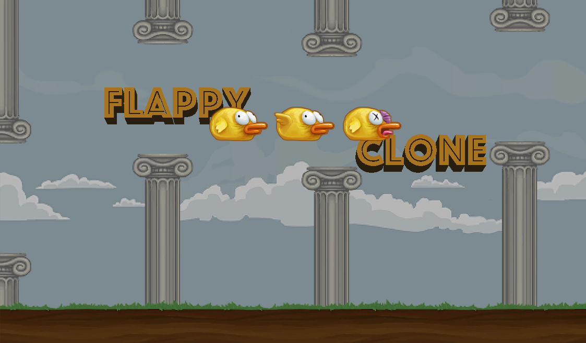

## Flappy Bird clone 
Self-made Flappy Bird Clone in Unity3D 
 
## Screenshots



 

## Features
- Full function game 
- Desktop Version 
- Web Version
- Score counter 
- Infinte game, progressively gets quicker


## Play the Game
### Option 1: Web Browser
[Click here to play!](https://play.unity.com/mg/other/webgl-builds-401239)
### Option 2: Run exe
1. See download the code section to get local repository on your machine.
2. From the root of the local repository, run ` FlappyClone Run/Flappy Clone `
## Open the Game

## Prerequisites:
1. UnityHub
2. Unity

## Download Code
1. Clone the repository:
```bash
 git clone https://github.com/JoelMoyal/Trettman-website.git
```


1. Open UnityHub
2. Download version:` 2022.3.24f1 ` to open this project
3. Open with the correct version Unity.


